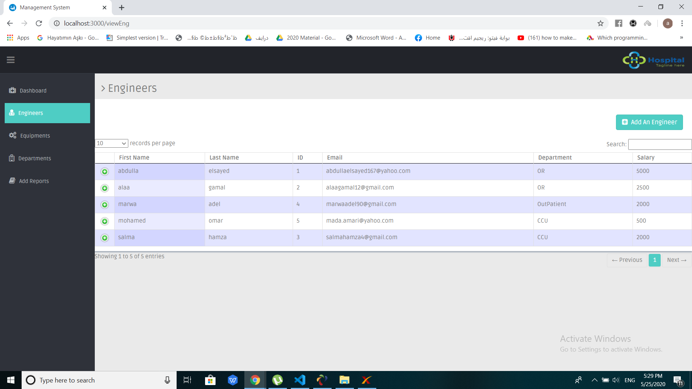
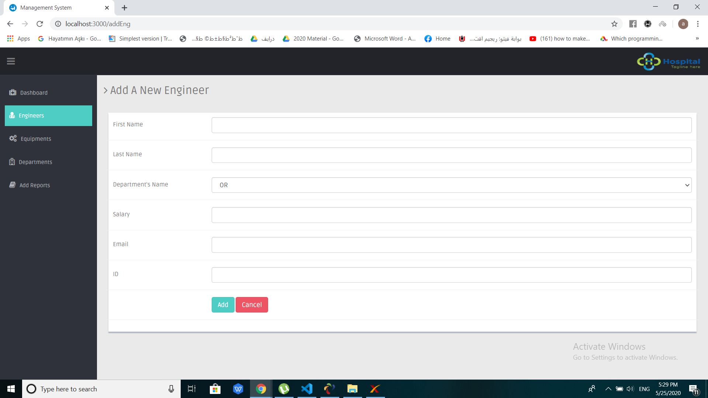
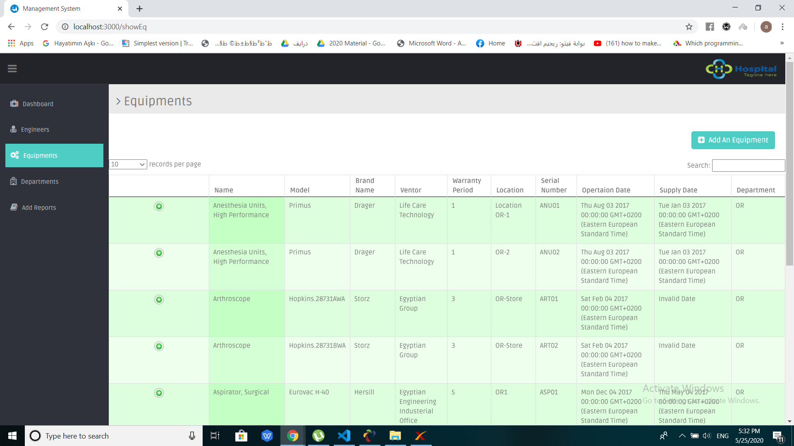
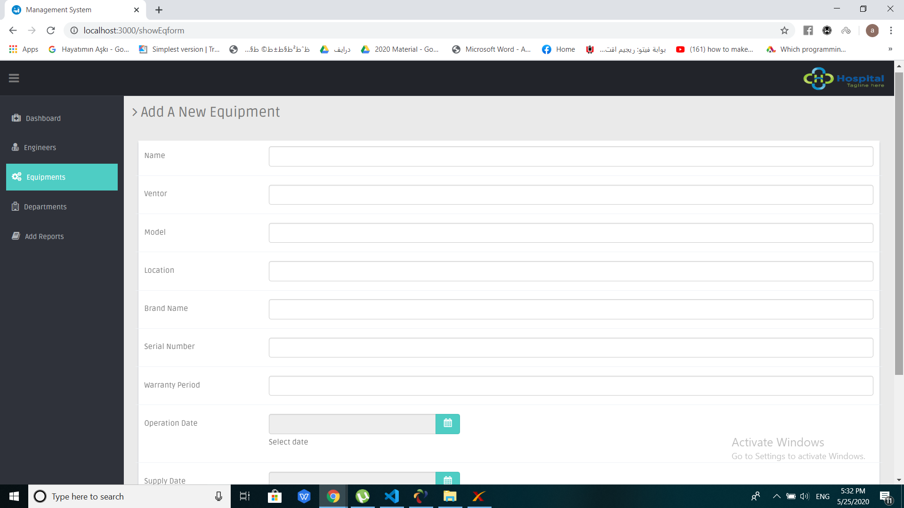
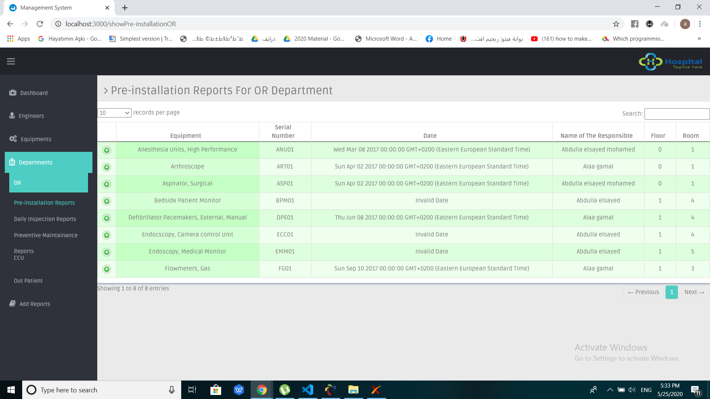
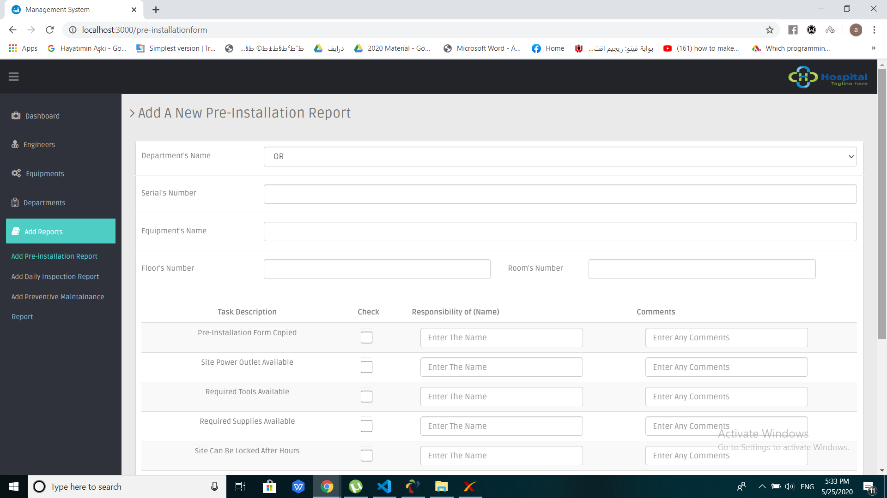
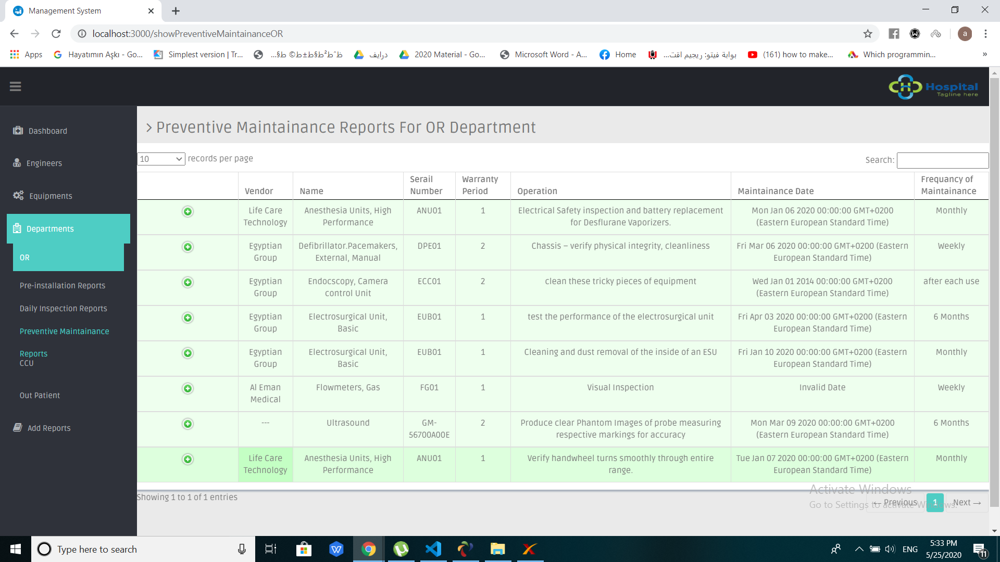
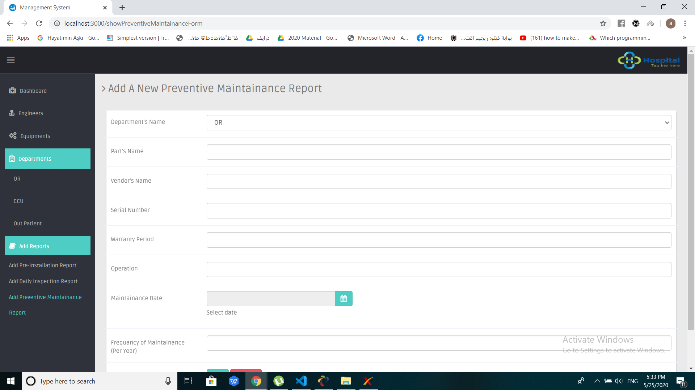
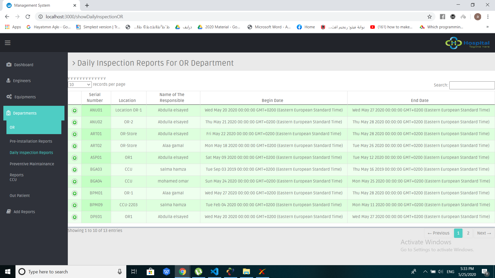
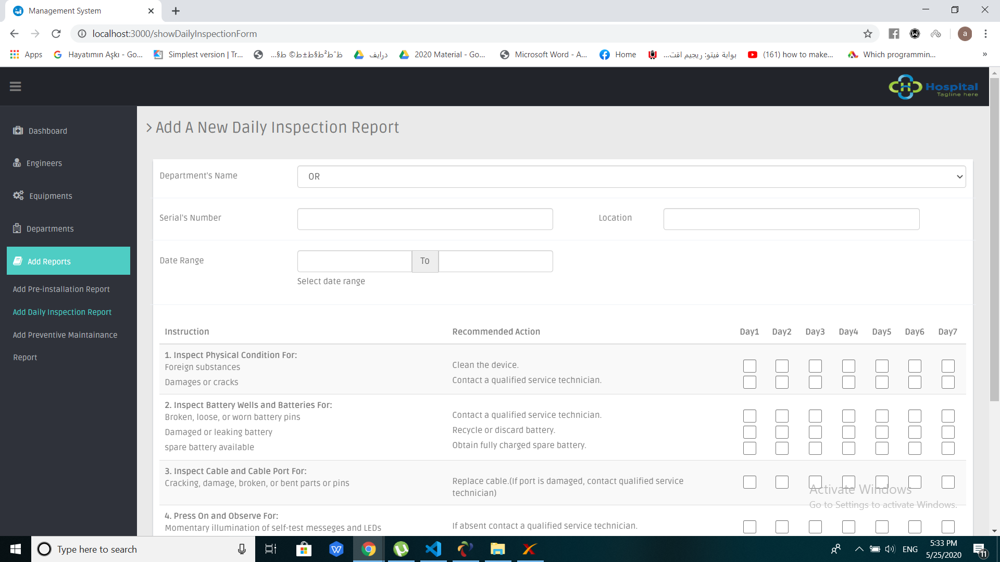

# Our Application
### It is CMMS application for hospitals, which stands for Computerized Maintenance Management System. It is a software designed to simplify maintenance management of medical equipments.

# Our project idea

A websit page the admin of the hospital can access it only . We are using mysql and NodeJs to build our project

# how did we start to work or think about this application
### 1) Firstly we need to read about the CMMS on the internet to know more about it and its functions.
### 2) Then we need to search about already existed CMMS application and the essential tables which it must be existed in it.
### 3) Finally we need to search for data for these tables.

# How to run the project

First we open ampps and creat a database with the name "clinical-web" 
and then we will import the data file, so that the data we filled can be seen 
Then we run the code by the command "node server.js" and it's connected w go to the browser and write on the search bar "localhost:3000/index" it should open the home page of our project and login by the mail and the passcode of the admin which are "admin@gamil.com" and the passcode "0000"

# Sources of our data
### we shared our data from dar el fouad hospital.

# Applications we have imitated 
### 1) example 1
### 2) example 2

# Explanation for work
### They are two main tables of data which is used for all the other tables which are Equipment table and Enginner table the rest of other tables depend on them.
### The three reports on the system which are pre-installation, daily inspection and preventive maintainance depend on these two tables. for example if you do not have equipments in your system so you can not fill any report as all the reports connected with the ID of the equipment which the system search for it in the equipment table, So if you have no ID in this table you can not fill reports.
### After adding equipment you can fill the reports from add reports menu when you click on it, you will find options to fill pre-installation, daily inspection or preventive maintainance reports.
### When you fill any report you must choose the department of this equipment, so you can find it easily when you go to the page of each department to look for a specific report.

### When you click on one of this department you will find three pages each one of them display for you records of one of the three reports.

# Tables of CMMS 
### Equipment table
<tr>
    <td>  </td>
    <td>  </td>
</tr>

### Engineers table
<tr>
    <td>  </td>
    <td>  </td>
</tr>

### Pre-installation table
<tr>
    <td>  </td>
    <td>  </td>
</tr>

### Preventive maintainance table
<tr>
    <td>  </td>
    <td>  </td>
</tr>

### Daily inspection table
<tr>
    <td>  </td>
    <td>  </td>
    <td>  </td>
</tr>

# Team Number

Number 3

# Team members

### 1) Abdulla Elsayed
### 2) Alaa Gamal
### 3) Marwa Adel 
### 4) Salma hamza **Leader**

